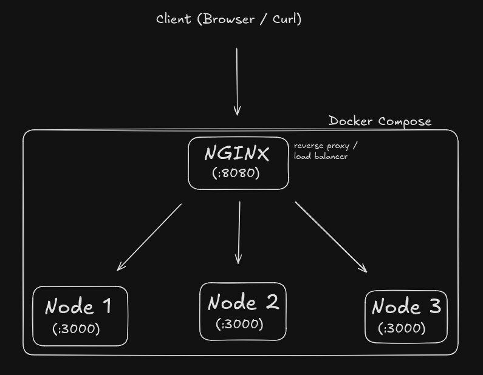

# Node.js Load Balacing with Nginx and Docker

---

## Overview

Este projeto tem como objetivo demonstrar, de forma prática, o uso do Nginx como reverse proxy e load balancer, além do uso do Docker para replicação de instâncias de uma aplicação Node.js.

A aplicação Node é intencionalmente simples. O foco do projeto não está na lógica de negócio, mas sim na infraestrutura, na arquitetura e na observação do comportamento do balanceamento de carga.

---

## Objetivo do projeto

O projeto foi desenvolvido com fins educacionais, com foco em:

- Compreender o funcionamento do Nginx como reverse proxy
- Entender como ocorre o balanceamento de carga na prática
- Explorar conceitos como:
  - Round-robin
  - Containers isolados
  - Comunicação entre containers
  - Portas internas vs externas
  - Single Entry Point
  - Observabilidade via logs

A proposta foi construir algo simples, mas que representasse conceitos reais utilizados em ambientes de produção.

---

## Arquitetura do projeto

A arquitetura é composta por:

- Um container Nginx atuando como:
  - Reverse proxy
  - Load balancer
  - Single Entry Point da aplicação

- Três containers Node.js:
  - Executando a mesma aplicação
  - Utilizando a mesma porta interna (3000)
  - Isolados entre si pelo Docker
- Um docker-compose.yml responsável por orquestrar todos os serviços.



---

# Como funciona o balanceamento

O Nginx recebe todas as requisições através da porta pública 8080.
A partir disso, ele redireciona as requisições para o grupo de servidores definido no bloco upstream, configurado em reverse-proxy/default.conf.

Como a aplicação é orquestrada via Docker Compose, cada instância é acessada pelo nome do serviço + porta interna (3000). O Docker fornece um DNS interno que permite essa comunicação entre containers.

Exemplo conceitual:

- Nginx → server1:3000
- Nginx → server2:3000
- Nginx → server3:3000

A distribuição das requisições pode ser observada através dos logs configurados no próprio Nginx.

---

## ⚙️ Como Rodar Localmente

### Pré-requisitos

- Docker

### Passos

```bash
# Clone o repositório
git clone git@github.com:williamsanttos-dev/nginx-reverse-proxy.git

# Acesse o diretório
cd nginx-reverse-proxy

# Crie um arquivo .env com base no .env.example
cp .env.example .env

# Inicie o container
docker compose up --build
```

Após isso, a aplicação estará acessível em:

`http://localhost:8080`

Você pode testar tanto pelo navegador quanto via curl:

`curl http://localhost:8080`

---

## Observabilidade (Logs e testes)

Para tornar visível o comportamento do balanceamento, foi necessário customizar o arquivo nginx.conf e configurar um log_format que exibisse informações adicionais sobre cada requisição processada.

A principal variável utilizada foi:

- `$upstream_addr` --> indica qual instância (IP:porta) respondeu a requisição

### Como testar a distribuição de requisições

Com a aplicação rodando, execute:

```bash
seq 20 | xargs -n1 -P10 curl -s http://localhost:8080 > /dev/null
```

Isso vai enviar 10 requisições em sequência para o Nginx no domínio declarado.

Esse comando envia múltiplas requisições simultâneas ao Nginx.

Para visualizar os logs:

```bash
Docker logs nginx
```

Ou, caso esteja rodando em foreground, os logs aparecem diretamente no terminal.


---

# Limitações e Aviso Importante

Este projeto não está pronto para produção.
Ele foi desenvolvido exclusivamente com o objetivo de compreender fundamentos de infraestrutura e arquitetura.

Algumas limitações intencionais:

- Nginx configurado apenas com HTTP
- Sem HTTPS / TLS
- Sem autenticação
- Sem rate limiting
- Sem firewall
- Sem WAF
- Sem health checks avançados
- Sem integração com provedores de borda (ex: AWS ELB, Cloudflare etc.)

Em um cenário real, seria recomendado utilizar uma solução de borda mais robusta (como um Elastic Load Balancer da AWS) para expor a aplicação à internet com segurança, deixando o Nginx restrito à comunicação interna entre serviços.

# Principais aprendizados

Este projeto proporcionou aprendizados práticos sobre:

- Funcionamento real de um load balancer
- Como configurar o Nginx como reverse proxy
- Comunicação entre containers usando o DNS interno do Docker
- Diferença entre:
  - Porta interna do container
  - Porta exposta no host
- Conceito de escalabilidade horizontal
- Importância de observabilidade (logs) em sistemas distribuídos
- Como múltiplas instâncias aumentam a resiliência da aplicação

Mais do que implementar, o foco foi entender o porquê de cada decisão técnica.
